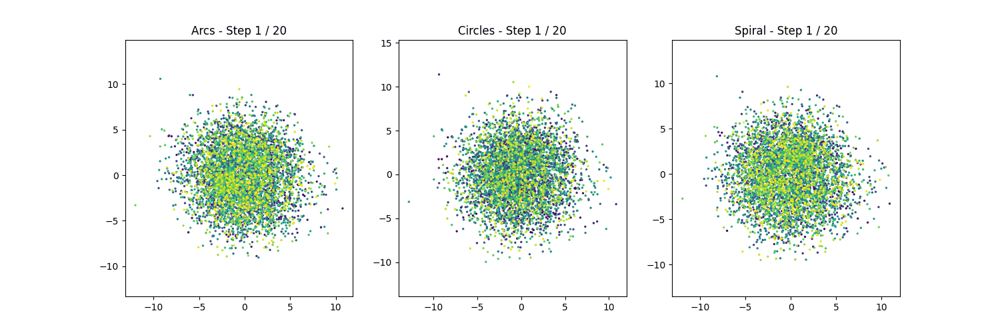

# Diffusion Schrödinger Bridge (DSB) for 2D Generative Modeling

**Authors:** Luca Barriviera, Maxime Didascalou

## Overview

This project implements the Diffusion Schrödinger Bridge (DSB) algorithm for generative modeling, based on the paper ["Diffusion Schrödinger Bridge with Applications to Score-Based Generative Modeling"](https://arxiv.org/abs/2106.01357) by De Bortoli et al. (2023).

The goal is to learn and generate samples from various 2D shape distributions (S-arcs, two circles, spiral) starting from a simple Gaussian prior distribution. The implementation uses PyTorch and follows the methodology described in the paper, particularly leveraging the mean-matching approximation (Proposition 3) to make the Iterative Proportional Fitting (IPF) procedure computationally feasible.

## Theoretical Background

The core idea relies on finding a stochastic process (the Schrödinger Bridge) that transforms a prior distribution $\pi_N$ (e.g., Gaussian noise) into a target data distribution $\pi_0$ over a time interval $[0, T]$, while staying "close" (in KL divergence sense) to a reference diffusion process.

-   **Iterative Proportional Fitting (IPF):** An iterative algorithm to approximate the Schrödinger Bridge by alternatingly enforcing the marginal constraints at $t=0$ and $t=N$.
-   **DSB Approximation:** Instead of directly estimating complex score functions ($\nabla \log p_t$) at each step, DSB uses a mean-matching objective derived from Proposition 3 of the paper. This involves training neural networks to approximate the forward ($F^n_k$) and backward ($B^n_k$) drift functions by minimizing a squared error loss based on simulated trajectories.

## Implementation Details

-   **Framework:** Python with PyTorch.
-   **Datasets:** Synthetic 2D datasets:
    -   S-shaped Arcs
    -   Two Concentric Circles
    -   Spiral
    -   Prior distribution: Isotropic Gaussian matched to the data's mean (0) and variance ($\sigma=3$).
-   **Model Architecture:** A Multi-Layer Perceptron (MLP) with sinusoidal positional encoding for time, similar to the architecture described in Appendix J.1 of the paper. Separate networks approximate the forward ($F_\alpha$) and backward ($B_\beta$) drift functions.
-   **Training:**
    -   The DSB algorithm iteratively updates $F_\alpha$ and $B_\beta$.
    -   **Forward Pass:** Simulate trajectories starting from data ($\pi_0$) using the current $F_\alpha$. Use these trajectories to train $B_\beta$ via the mean-matching loss.
    -   **Backward Pass:** Simulate trajectories starting from the prior ($\pi_N$) using the updated $B_\beta$. Use these trajectories to train $F_\alpha$ for the next iteration.
    -   **Optimizer:** Adam (lr= $10^{-4}$, $\beta_1=0.9$).
    -   **Hyperparameters:** Time steps $N=20$, step size $\gamma=0.01$ (Total time $T=0.2$), DSB iterations $L=20$. Batch size 512.
-   **Generation:** Samples are generated by running the final learned backward process $B_\beta$ starting from the prior distribution at $t=N$.

## Results

The included Jupyter Notebook (`.ipynb`) demonstrates the training process and visualizes the results:

-   Plots showing the generated samples after 1, 5, and 20 DSB iterations for each dataset.
-   An animation illustrating the backward generation process, transforming the prior noise into the target shapes over the N time steps.

## Reference

De Bortoli, V., Thornton, J., Heng, J., & Doucet, A. (2023). *Diffusion Schrödinger Bridge with Applications to Score-Based Generative Modeling*. Advances in Neural Information Processing Systems (NeurIPS). ([arXiv:2106.01357](https://arxiv.org/abs/2106.01357))
